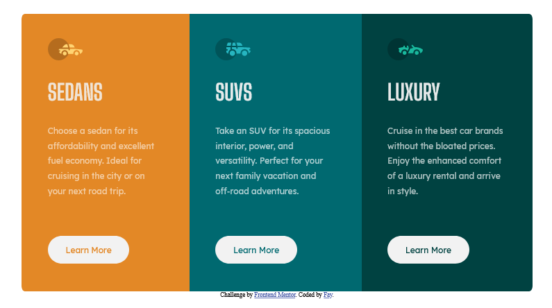

# Frontend Mentor - [3-column](https://nottohave.github.io/3-columns/)

### The challenge

Users should be able to:

- View the optimal layout depending on their device's screen size
- See hover states for interactive elements

### Screenshot

### Links

- Live Site URL: [Click here](https://nottohave.github.io/3-columns/)

### Built with

- Semantic HTML5 markup
- CSS custom properties
- Flexbox
- Mobile-first workflow

### What I learned

HTML CSS flex, planning for which components to use and apply across the page before begin to build.
